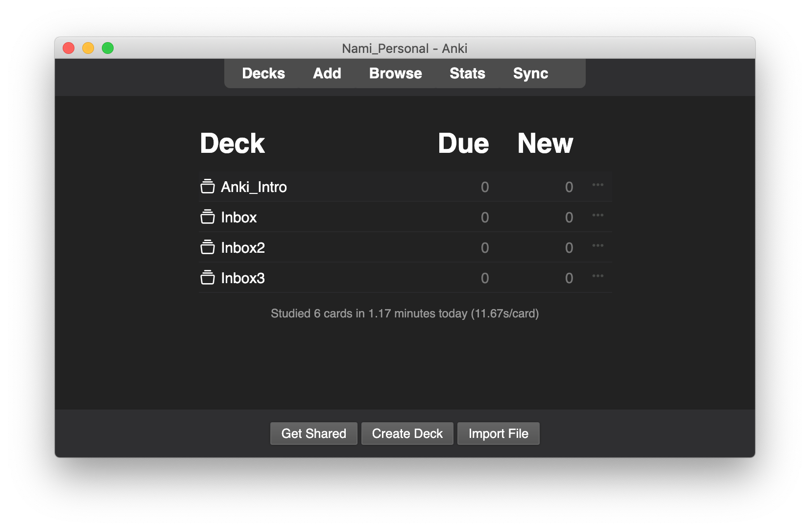

# A Lite Theme for Anki

I'm working on partial CSS to change the appearance of Anki. This project is based on [Custom Background](https://github.com/AnKingMed/Custom-background-image-and-gear-icon).

## Feature

- Color scheme with lower saturation
- Adding hover hints on gear, and changing icon to "•••"
- Adjust spacing and font size
- Work on Lightmode and Darkmode.

## Install

1. Install Dependency: [Custom Background](https://github.com/AnKingMed/Custom-background-image-and-gear-icon)

   **The compatibility is based on the dependency. Please check.**

2. Merge user-files into add-on's folder.

3. Replace config.json in add-on's folder.

## Todo

- [ ] Button Appearance
- [ ] Learning start page

## To Solve

- [x] ~~Fix box size issues while hovering~~  
(Thanks to @jasonesiegel)

## Hard to solve

Due to the limitation of css, here're something hard to solve

- [x] ~~In deckbrowse, the `th` element's vertical start position.~~
- [x] ~~In deckbrowse, the whitespace after `th` element .~~
- [ ] I can't make cards icon follow decktree. Because source code makes indent by adding &nbsp.
- [x] ~~In toolbar, I can't fix width of each `hitem` ,though it's inline-block.~~(No need)
- [ ] In toolbar, the icon after `sync` is invisible but still takes up a place.
- [ ] In toolbar, I can't replace text with icons.
- [ ] Overall font